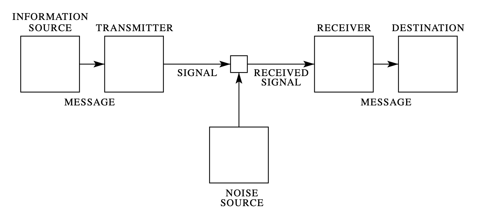

**An introduction to some information theory concepts.**
***
### A Motivation for Quantifying Information From Shannon's Perspective

Information theory originated in 1948 with [Claude Shannon](https://en.wikipedia.org/wiki/Claude_Shannon)'s paper [*The Mathematical Theory of Communication*](https://people.math.harvard.edu/~ctm/home/text/others/shannon/entropy/entropy.pdf), which he published during his time at [Bell Labs](https://en.wikipedia.org/wiki/Bell_Labs). In the paper's introduction, Shannon begins by considering that in order to deal with problems involving communication systems, there must first exist a mathematical framework to represent the physical elements involved in such systems. He defines that a communication system have five components as shown in Fig. 1: information source, transmitter, noise source, receiver, and destination. 

To understand this definition of a communication system, we can imagine that Alice (the information source) has a message she wants to send to Bob (the destination). The message is first transformed by Alice's transmitter into a suitable signal for transmission. The signal then travels through a channel, the medium between Alice and Bob. When the signal reaches Bob's receiver, it performs the inverse operation of Alice's transmitter and thus reconstructs the original message from the received signal, which can ultimately be read by Bob. 

***

*Fig. 1 — Schematic diagram of a general communication system (Shannon, 1948).*
*** 

Shannon additionally considers that there exists three different categories of such systems: discrete, continuous, and mixed. In a discrete system, the message and signal received are a sequence of discrete symbols; we can imagine this as the message being a sequence of letters and the signal a sequence of zeros and ones. In a continuous system, the message and signal received are treated as continuous functions, examples including analog waveforms, such as radio signals, speech signals, and television images. In a mixed system, both discrete and continuous variables are involved, an example being PCM (Pulse-Code Modulation) transmission of speech, where the original signal is continuous, but the message retrieved is discrete since the signal is sampled, digitized, and quantized. 

Later in the paper, in the context of discrete noiseless systems (no noise source in Fig 1.), Shannon poses the following questions regarding the information source: **"How is an information source to be described mathematically, and how much information in bits per second is produced in a given source?"** In this context, a discrete information source generates messages as sequences of symbols. As an example, we can think about a message written in English, where the symbols are the letters of the alphabet. Simply put, a message in English is a sequence of letters.

To mathematically model a discrete information source, we can represent it as a [stochastic process](https://en.wikipedia.org/wiki/Stochastic_process), which is a sequence of random variables, where the probability of each symbol may depend on the previous symbols. More formally, 

These are known mathematically as discrete [Markov processes](https://en.wikipedia.org/wiki/Markov_chain). 

(google books n-gram https://books.google.com/ngrams/info, probabilities are based on occurrence throughout digital books, or just use n-grams as a general idea)

Shannon's argument was that having *a priori* statistical knowledge, specifically a known or assumed probability distribution of the symbols, of the discrete source would allow for the receiver to assign shorter code to more probable symbols and longer codes to less probable ones. For example, we know that the most frequent letter in the English language is *E* and the least frequents are *Q*, *X*, and *Z*. Statistical structure like this is exploited in encodings such as morse code, where common letters like *E* are represented by a single dot, while rare letters like *Q*, *X*, and *Z* have the longest sequences of dots and dashes. 

***
### References
1. [*The Mathematical Theory of Communication* (Claude Shannon, 1948)](https://people.math.harvard.edu/~ctm/home/text/others/shannon/entropy/entropy.pdf)

